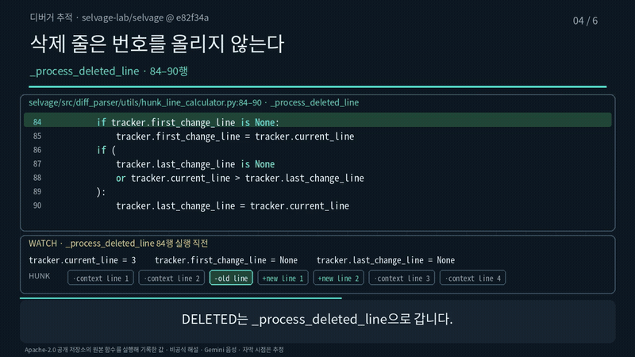

# source-to-explainer-video

[English](README.md) | 한국어

원본 하나를 골라 나레이션이 있는 설명 영상으로 만드는 에이전트 스킬입니다.
원본은 책의 한 절이어도 되고, 논문이나 명세, 코드 변경, 저장소 전체여도 됩니다.

영상을 만들고 끝내지 않습니다. 설명이 원본과 맞는지 대조하고, 완성된 MP4 파일을 직접
검사합니다. 같은 영상을 다시 만들 수 있는 소스 패키지도 남깁니다.

## 예제 영상 세 편

설명 방식은 세 가지입니다. 방식마다 공개 원본으로 만든 예제가 하나씩 있고,
세 편 모두 한국어판과 영어판을 따로 만들었습니다.

### 1. 책 한 절을 개념 영상으로

에릭 레이먼드가 쓴 『성당과 시장』(v3.0)의 '일찍 내고, 자주 내라' 절을 여섯 장면으로
풀었습니다. 리누스의 법칙이 어떤 믿음을 뒤집었는지 따라갑니다.


- 영상: [한국어 (3분 4초)](example-concept/preview/ko.mp4) · [영어 (3분 7초)](example-concept/preview/en.mp4)
- 자막: [한국어 SRT](example-concept/preview/ko.srt) · [영어 SRT](example-concept/preview/en.srt)
- [만드는 방법과 검사 결과](example-concept/README.ko.md)

### 2. 저장소를 아키텍처 리뷰 영상으로

YC 소프트웨어 팀이 공개한 [QM](https://github.com/yc-software/qm)을 커밋 `daeb2deb`
기준으로 리뷰합니다. 일곱 장면에서 요청 하나가 지나가는 길을 따라갑니다. 작업 큐, 리스,
리퍼, 세션 테이프, 하네스, 스코프를 차례로 봅니다. 마지막 장면에서는 직접 돌린 테스트와
확인하지 못한 것을 나눠 보여 줍니다.


- 영상: [한국어 (3분 56초)](example-architecture/preview/ko.mp4) · [영어 (3분 54초)](example-architecture/preview/en.mp4)
- 자막: [한국어 SRT](example-architecture/preview/ko.srt) · [영어 SRT](example-architecture/preview/en.srt)
- [만드는 방법과 검사 결과](example-architecture/README.ko.md)

### 3. 오픈소스 함수를 디버거처럼 따라가기

[selvage](https://github.com/selvage-lab/selvage)에서 hunk의 실제 변경 줄 범위를 계산하는 함수를
여섯 장면으로 따라갑니다. 고정한 커밋의 원본 함수를 저장소 테스트의 입력으로 그대로 실행하고,
줄마다 기록한 값만 화면에 띄웁니다. 삭제 줄이 줄 번호를 올리지 않는 순간이 핵심입니다.



- 영상: [한국어 (2분 51초)](example-debugger/preview/ko.mp4) · [영어 (2분 45초)](example-debugger/preview/en.mp4)
- 자막: [한국어 SRT](example-debugger/preview/ko.srt) · [영어 SRT](example-debugger/preview/en.srt)
- [만드는 방법과 검사 결과](example-debugger/README.ko.md)

가장 작은 출발점이 필요하면 [가상 재고 함수 예제](example-code-trace/README.ko.md)를 보세요.
18초짜리이고, 코드 줄 강조 방식과 여러 파트로 나눈 플레이어를 함께 보여 줍니다.

GIF에는 소리가 없습니다. MP4를 받아서 들어 보세요.

## 어떤 방식을 고르나

| 보고 싶은 것 | 방식 | 참고 문서 |
|---|---|---|
| 책·논문·명세의 개념 | 장면마다 주장 하나, 그림의 변화 하나 | [SKILL.md](SKILL.md) |
| 코드 변경이나 저장소 구조 | 동작 흐름을 그림으로. 코드를 한 줄씩 읽지 않음 | [from-code-review.md](references/from-code-review.md) |
| 코드의 실행 순서와 값 | 코드 줄 강조, 또는 실제 실행을 기록한 디버거 추적 | [code-trace.md](references/code-trace.md) |

## 왜 영상부터 만드나

웹 페이지는 책상 앞에서 봐야 합니다. 나레이션이 있는 영상은 걸으면서도 들을 수 있습니다.
흐름과 조건, 아직 확인하지 않은 부분을 먼저 귀로 익혀 두면, 나중에 원본이나 코드를 볼 때
훨씬 빨리 읽힙니다. 그래서 기본 결과물은 영상이고, 글이나 HTML은 요청할 때만 만듭니다.

## 어떤 원본을 써도 되나

설명을 만든다고 원본을 다시 배포할 권리가 생기지는 않습니다. 공개 예제에는 다음 원본을 씁니다.

- **수정과 배포를 허락한 글**: 퍼블릭 도메인, CC BY, Open Publication License 같은 라이선스.
  『성당과 시장』은 Open Publication License 2.0으로 복제와 수정을 허락합니다.
- **허용 라이선스의 공개 저장소**: MIT, Apache-2.0 등. 커밋을 고정하고 라이선스를 밝힙니다.
- **직접 쓴 자료**: 최소 코드 추적 예제의 가상 재고 함수처럼 처음부터 새로 만든 예제.

시판 도서, 유료 강의, 남의 SNS 글은 짧게 인용하는 정도에 그치세요. 영상의 중심 원본으로
쓰려면 저작권자의 허락을 받아야 합니다. 개인 학습용으로만 만들었다면 공개하지 않습니다.

## 빠르게 시작하기

저장소 루트에서 실행합니다.

```bash
python3 -m venv .venv && .venv/bin/pip install -r requirements.txt
PATH=".venv/bin:$PATH" bash example/assets/fetch-font.sh        # 본문 글꼴(OFL)
PATH=".venv/bin:$PATH" bash example/assets/fetch-font.sh mono   # 코드용 고정폭 글꼴(OFL)

# 음성 없이 파이프라인만 확인하는 기본 예제 (임시 음성은 말소리가 없는 배경음)
cd example
bash make_demo_audio.sh
../.venv/bin/python design.py
../.venv/bin/python prepare.py
../.venv/bin/python render.py --samples
../.venv/bin/python render.py --determinism
../.venv/bin/python render.py          # → master.mp4
../.venv/bin/python qa.py
../.venv/bin/python fidelity.py
../.venv/bin/python package.py
cd ..

# 공개 원본 예제 세 편: 한국어판과 영어판을 함께 만든다
export GEMINI_API_KEY=...                  # 아직 음성이 없는 장면에만 쓴다
.venv/bin/python example-concept/pipeline.py
.venv/bin/python example-architecture/pipeline.py --lang ko
.venv/bin/python example-debugger/pipeline.py
```

음성은 장면마다 Gemini TTS(`gemini-3.8-flash-lite-tts`)로 만듭니다. 대본·모델·목소리가
같은 음성이 이미 있으면 다시 만들지 않습니다. 이때는 API 키도 읽지 않습니다.
`WHISPER_MODEL`에 whisper.cpp 모델 경로를 넣으면, 장면마다 음성을 받아 적어 대본과
비교합니다.

## 저장소 구조

```text
SKILL.md                     스킬 본문: 작업 순서, 결과물 기준, 흔한 실수
references/
  pipeline.md                명령 순서와 지켜야 할 조건
  renderer-notes.md          화면 배치, 애니메이션, 장면 전환 규칙
  tts.md                     장면별 음성 생성과 기록, 재사용, 자막
  video-qa.md                완성된 영상 파일 검사 목록
  source-fidelity.md         원본 항목·조건·예외 대조
  from-code-review.md        코드 변경과 아키텍처 리뷰
  code-trace.md              코드 줄 추적과 디버거 추적
  asd-ste-80.md              명료한 영어 문장 규칙
  writing-ko.md              한국어 나레이션·문서 쓰기
example/                     공통 파이프라인과 3장면 기본 예제
example-concept/             책 한 절 → 개념 영상 (한국어·영어)
example-architecture/        QM 저장소 → 아키텍처 리뷰 영상 (한국어·영어)
example-debugger/            selvage 함수 → 디버거 추적 영상 (한국어·영어)
example-code-trace/          가상 함수 → 코드 추적 최소 예제
requirements.txt             버전을 고정한 Python 의존성
```

## 필요한 도구

- Python 3.11 이상
- `ffmpeg`, `ffprobe`
- Pillow, NumPy, fontTools (`requirements.txt`의 버전)
- 한글을 포함하고 재배포할 수 있는 글꼴. 저장소에 넣지 않고 따로 받습니다.
- 선택: 실제 음성을 만들 때는 `GEMINI_API_KEY`, 음성 인식 검사를 할 때는 `whisper-cli`와 모델

## 제작 원칙

1. **원본부터 고정합니다.** 판본, 범위, 커밋, 해시를 기록합니다. 비슷한 자료로 바꾸지 않습니다.
2. **장면 하나에는 주장 하나만 둡니다.** 그림도 한 가지만 바꿉니다. 경로가 열리거나 상태가
   바뀌는 움직임이 설명을 맡습니다.
3. **지어낸 비유는 비유라고 밝힙니다.** 좌표나 개수가 측정값이 아니면 그렇다고 적습니다.
4. **완성된 파일을 검사합니다.** 프레임 수를 세고 끝까지 디코딩합니다. 장면이 바뀌는 순간과
   0.08초, 0.17초, 0.4초 뒤의 화면을 뽑아 봅니다.
5. **원본 대조와 영상 검사를 따로 합니다.** 영상이 잘 재생된다고 설명이 맞다는 뜻은 아닙니다.
6. **하지 않은 검사는 하지 않았다고 씁니다.** 사람이 끝까지 들었는지, 음성 인식과 자막
   정렬을 했는지, 다른 사람이 검토했는지 기록합니다.
7. **공개는 따로 요청받았을 때만 합니다.** 영상을 만들어 달라는 말은 배포해도 된다는 뜻이 아닙니다.

## 라이선스

- 이 저장소의 스킬 문서와 예제 코드는 MIT입니다. [LICENSE](LICENSE)를 보세요.
- 글꼴은 따로 받고, 라이선스 파일을 함께 둡니다. [글꼴 안내](example/assets/README.md)를 보세요.
- 예제가 설명하는 원본의 권리는 원저작자에게 있습니다. 『성당과 시장』은 Eric S. Raymond의
  글로 Open Publication License 2.0을 따릅니다. QM은 QM 기여자들의 MIT 라이선스 코드이고,
  selvage는 Apache-2.0 라이선스 코드입니다. 세 예제 모두 비공식 해설입니다.
- 비공개 스캔, 원문 전체를 OCR한 텍스트, 인증 정보, 고객 데이터는 커밋하지 않습니다.
