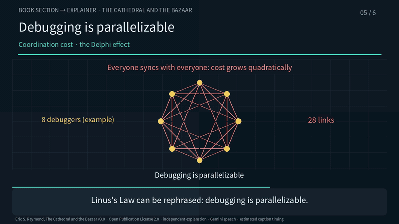
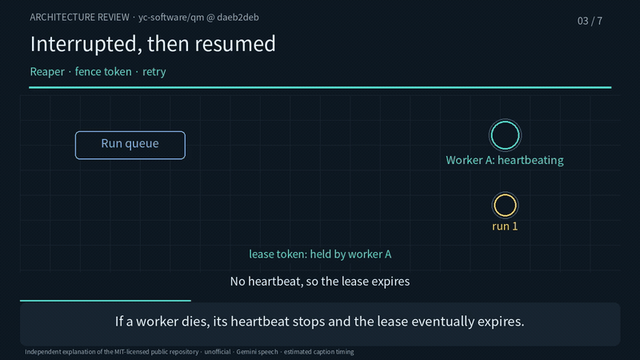
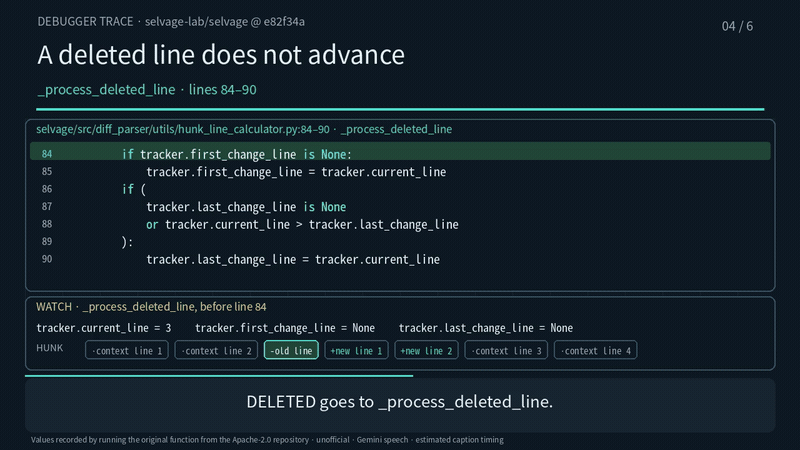

# source-to-explainer-video

English | [한국어](README.ko.md)

An agent skill that turns one verified source into a narrated explainer video. The source
can be a book section, a paper, a spec, a code change, or a whole repository.

The video is not the end of the job. The skill checks the explanation against the source,
audits the encoded MP4 itself, and leaves a source package that re-renders the same video.

## Three example videos

There are three explanation styles, each with an example built from a public source. All
three were built in Korean and in English from one shared plan.

### 1. A book section as a concept video

Six scenes on the "Release Early, Release Often" section of Eric S. Raymond's
*The Cathedral and the Bazaar* (v3.0): what belief Linus's Law overturned, and how.



- Video: [English (3:07)](example-concept/preview/en.mp4) · [Korean (3:04)](example-concept/preview/ko.mp4)
- Captions: [English SRT](example-concept/preview/en.srt) · [Korean SRT](example-concept/preview/ko.srt)
- [How it is built and checked](example-concept/README.md)

### 2. A repository as an architecture review

A review of YC Software's [QM](https://github.com/yc-software/qm) at commit `daeb2deb`.
Seven scenes follow one request through the run queue, the lease, the reaper, the session
tape, swappable harnesses and scopes. The last scene separates the tests actually run from
what was not verified.



- Video: [English (3:54)](example-architecture/preview/en.mp4) · [Korean (3:56)](example-architecture/preview/ko.mp4)
- Captions: [English SRT](example-architecture/preview/en.srt) · [Korean SRT](example-architecture/preview/ko.srt)
- [How it is built and checked](example-architecture/README.md)

### 3. An open-source function as a debugger trace

Six scenes follow the function in [selvage](https://github.com/selvage-lab/selvage) that
computes which lines a hunk actually changed. The original function from a pinned commit
runs on the repository's own test input, and only the values recorded at each line appear.
The key moment is a deleted line that does not advance the line counter.



- Video: [English (2:45)](example-debugger/preview/en.mp4) · [Korean (2:51)](example-debugger/preview/ko.mp4)
- Captions: [English SRT](example-debugger/preview/en.srt) · [Korean SRT](example-debugger/preview/ko.srt)
- [How it is built and checked](example-debugger/README.md)

For the smallest starting point, see the [fictional inventory example](example-code-trace/README.md):
18 seconds, with the source-line mode and a multi-part player.

GIFs are silent. Download the MP4s to hear the narration.

## Choosing a style

| Viewer wants | Style | Read |
|---|---|---|
| Understand a book, paper or spec | one claim and one visual change per scene | [SKILL.md](SKILL.md) |
| Understand a change or a codebase | behaviour drawn as paths; no line-by-line reading | [from-code-review.md](references/from-code-review.md) |
| Follow execution and changing values | source-line highlights or a recorded debugger trace | [code-trace.md](references/code-trace.md) |

## Why video first

A web page needs a desk. A narrated video can be heard while walking. A reviewer who has
already heard the paths, the conditions and the unverified parts reads the source much
faster afterwards. Video is the default output; written and HTML outputs are opt-in.

## Which sources are safe to use

Explaining a source does not give you the right to redistribute it. The public examples use:

- **Text licensed for modification and redistribution**: public domain, CC BY, or the Open
  Publication License, which covers *The Cathedral and the Bazaar*.
- **Public repositories under permissive licences** such as MIT or Apache-2.0, pinned to a
  commit with the licence stated.
- **Material you wrote yourself**, like the fictional inventory function in the minimal example.

Keep commercial books, paid courses and other people's social posts to short quotations,
or get the rights holder's permission before making them the core source. Keep private
study videos private.

## Quick start

Run from the repository root.

```bash
python3 -m venv .venv && .venv/bin/pip install -r requirements.txt
PATH=".venv/bin:$PATH" bash example/assets/fetch-font.sh        # text font (OFL)
PATH=".venv/bin:$PATH" bash example/assets/fetch-font.sh mono   # monospace code font (OFL)

# Minimal example with placeholder audio (room tone, not speech)
cd example
bash make_demo_audio.sh
../.venv/bin/python design.py
../.venv/bin/python prepare.py
../.venv/bin/python render.py --samples
../.venv/bin/python render.py --determinism
../.venv/bin/python render.py          # → master.mp4
../.venv/bin/python qa.py
../.venv/bin/python fidelity.py
../.venv/bin/python package.py
cd ..

# The three public-source examples, Korean and English
export GEMINI_API_KEY=...                  # used only for scenes without cached speech
.venv/bin/python example-concept/pipeline.py
.venv/bin/python example-architecture/pipeline.py --lang en
.venv/bin/python example-debugger/pipeline.py
```

Speech is synthesised per scene with Gemini TTS (`gemini-3.8-flash-lite-tts`). Audio whose
script, model, voice and style already match is reused without reading the API key. Set
`WHISPER_MODEL` to a whisper.cpp model to transcribe each scene and compare it with the script.

## Layout

```text
SKILL.md                     the skill: workflow, output contract, pitfalls
references/
  pipeline.md                exact command order and invariants
  renderer-notes.md          layout constants, animation vocabulary, cut rules
  tts.md                     per-scene synthesis, provenance, reuse, captions
  video-qa.md                the encoded-file checklist
  source-fidelity.md         inventory, conditions and risk transforms
  from-code-review.md        change reviews and architecture reviews
  code-trace.md              source-line and recorded-debugger walkthroughs
  asd-ste-80.md              clear-English pass (~80 % ASD-STE100 strictness)
  writing-ko.md              Korean narration and document writing
example/                     shared pipeline and a 3-scene minimal example
example-concept/             book section → concept video (Korean, English)
example-architecture/        QM repository → architecture review (Korean, English)
example-debugger/            selvage function → debugger trace (Korean, English)
example-code-trace/          fictional function → minimal code-trace example
requirements.txt             pinned dependencies
```

## Requirements

- Python 3.11+
- `ffmpeg` / `ffprobe`
- Pillow, NumPy, fontTools (versions pinned in `requirements.txt`)
- a redistributable font with Korean glyphs, fetched rather than committed
- optional: `GEMINI_API_KEY` for real speech, `whisper-cli` and a model for the ASR check

## Design rules that matter most

1. **Pin the source first.** Record edition, range, commit and hashes. Never substitute a
   similar work.
2. **One claim per scene, one visual change per claim.** The change carries the logic: a
   path opening, a state replaced, a mesh collapsing into a star.
3. **Declare your metaphors.** If positions or counts are not measured data, say so.
4. **Verify the encoded file.** Count frames, decode fully, and sample every cut at
   +0.08/+0.17/+0.4 s.
5. **Keep the fidelity review separate from video QA.** A file that plays proves nothing
   about whether the explanation is right.
6. **Name the checks you did not run**: full human listening, forced alignment,
   independent review.
7. **Publishing is a separate explicit step.** Producing a video is not permission to
   distribute it.

## Licensing

- This repository (skill text and example code): MIT, see `LICENSE`.
- Fonts are fetched separately and keep their licence file. See `example/assets/README.md`.
- Explained sources keep their own rights. *The Cathedral and the Bazaar* is by Eric S.
  Raymond under the Open Publication License 2.0; QM is MIT-licensed code by the QM
  contributors; selvage is Apache-2.0 code. All three examples are unofficial explanations.
- Do not commit private scans, full OCR text, credentials or customer data.
