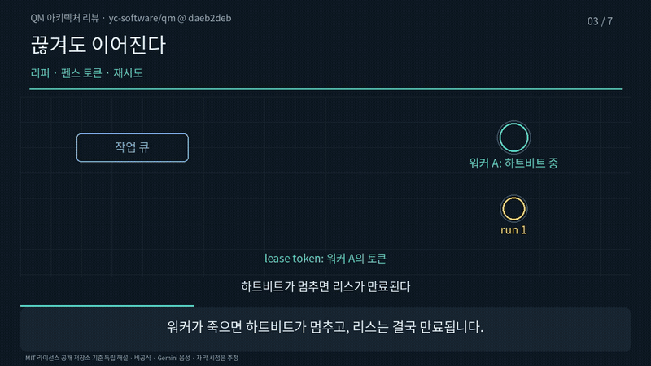

# 저장소 → 아키텍처 리뷰 영상

[English](README.md) | 한국어

YC 소프트웨어 팀이 공개한 [QM](https://github.com/yc-software/qm)을 커밋 `daeb2deb` 기준으로
리뷰한 일곱 장면짜리 영상입니다. PR 하나가 아니라 시스템 전체의 뼈대를 봅니다.
요청 하나가 지나가는 길을 따라가며, 장면마다 동작 하나를 그림으로 설명합니다.
코드를 한 줄씩 읽어 주지는 않습니다.



| | 한국어 | 영어 |
|---|---|---|
| 영상 | [ko.mp4](preview/ko.mp4) · 3분 56초 · 5.2MB | [en.mp4](preview/en.mp4) · 3분 54초 · 5.4MB |
| 자막 | [ko.srt](preview/ko.srt) · 45개 | [en.srt](preview/en.srt) · 45개 |
| 대표 화면 | [ko.png](preview/ko.png) | [en.png](preview/en.png) |

QM 관리자가 만든 공식 문서가 아닌 비공식 해설입니다. QM은 MIT 라이선스입니다.

## 원본 고정

`plan.py`에 저장소, 커밋, 그리고 장면이 인용하는 파일 일곱 개의 Git blob 해시를 적어 두었습니다.
`pipeline.py`는 그 커밋의 파일을 받아 blob 해시를 다시 계산하고, 하나라도 다르면 멈춥니다.

| 파일 | 쓰인 장면 |
|---|---|
| `README.md` 89–92행 | 1, 6 |
| `docs/SPEC.md` 15–21행 | 1, 5, 6 |
| `docs/session-tape-spec.md` 5–60행 | 4, 5 |
| `src/runs/postgres-run-store.ts` 218–271, 340–345, 527–563행 | 2, 3 |
| `src/runs/worker.ts` 34행 | 2 |
| `src/runs/run-store.ts`, `src/runs/reaper.ts` | 2, 3 |

## 장면 구성

| 장면 | 주장 | 그림의 변화 |
|---|---|---|
| 1 | 모든 턴은 코어와 작업 큐를 거치고, 상태는 Postgres에 남는다 | 슬랙에서 모델까지 상자가 한 칸씩 그려진다 |
| 2 | 워커는 세션마다 하나씩, 오래된 실행부터 잠금 없이 가져가고 리스를 받는다 | 큐 맨 앞의 run 1이 빠지고 워커가 실행 중이 된다 |
| 3 | 리퍼는 토큰을 바꿔 펜스를 친 뒤 실행을 다시 넣거나 실패로 마친다 | 워커가 멈추고 run 1이 큐로 돌아간다 |
| 4 | 모델은 테이프에 있는 것만 읽는다. 예외도 밝힌다 | 테이프에 기록이 쌓이고 상자가 fold로 바뀐다 |
| 5 | 도구 목록은 하나, 하네스는 바꿀 수 있고 바뀐 사실은 테이프에 남는다 | 하네스가 Pi에서 Codex로 바뀐다 |
| 6 | 스코프는 격리되고, 넘으려면 명시적 grant가 필요하다 | 두 스코프 사이 벽이 낮아진다 |
| 7 | 직접 돌린 테스트와 확인하지 못한 것 | 점검 칸 네 개가 확인·미확인 색으로 켜진다 |

보안 등급(Strict·Auto·Dangerous), 인증 정보, 백그라운드 작업은 분량 때문에 다루지 않았습니다.

## 직접 돌린 테스트

같은 커밋에서 아래 명령을 실행했습니다(Node v24.20.0, macOS arm64).

```bash
npm ci --ignore-scripts && npm run build:connector-sdk
node --experimental-test-module-mocks --test test/run-store.test.ts test/run-stale.test.ts \
  test/lease-keepalive.test.ts test/scope-reach.test.ts test/worker-reaper.test.ts \
  test/tape-fold.test.ts test/session-tape.test.ts test/sandbox-resources.test.ts
```

170개 중 166개가 통과했습니다. 실패한 4개는 모두 `scope-reach.test.ts`에 있습니다. 로컬 샌드박스에서
커넥터 SDK 설치가 실패했습니다(`rc=64`). 그래서 이 부분의 동작은 확인하지 못한 것으로 둡니다.
테스트는 메모리 저장소로 돌았습니다. Postgres SQL 경로는 코드를 읽기만 했습니다.

## 만드는 방법

```bash
export GEMINI_API_KEY=...                       # 음성이 없는 장면에만 쓴다
export WHISPER_MODEL=/path/to/ggml-small.bin    # 선택: 음성 인식 비교
.venv/bin/python example-architecture/pipeline.py
```

구조는 [책 한 절 예제](../example-concept/README.ko.md)와 같습니다. `plan.py`에 장면을 쓰고,
`pipeline.py`가 원본을 확인한 뒤 언어마다 공통 파이프라인을 돌립니다.

## 검사한 것

| 항목 | 결과 |
|---|---|
| 영상 형식 | 1280×720, 30fps, H.264 + AAC 모노 48kHz. 프레임 수 7,093(한국어) · 7,028(영어) 일치 |
| 전체 디코딩 | 오류 없음 |
| 장면 전환 | 전환 화면 24장을 완성 파일에서 추출 |
| 글자 배치 | 언어마다 샘플 89장에서 겹침 없음 |
| 음성 | 최대 진폭 0.739(한국어) · 0.829(영어), 잘린 샘플 0 |
| 패키지 재실행 | 압축(60개 파일)을 새 폴더에 풀어 2초 영상을 렌더링하고 RGB 해시 비교 |
| 음성 인식 비교 | 장면별 일치도 한국어 0.825~0.931, 영어 0.965~1.0 |

한국어판 일치도가 낮은 장면(2, 5, 6)은 `pending`, `harness`, `grant` 같은 영어 코드 이름이
들어 있는 장면입니다. 음성 인식 모델이 이 이름을 한글로 받아 적어서 점수가 내려갔습니다.
사람이 직접 들어 확인할 대상으로 표시해 둡니다.

음성은 Gemini `gemini-3.8-flash-lite-tts`의 `Kore` 목소리로 만들었습니다.

## 하지 않은 검사

- 사람이 영상 전체를 이어서 들어 보지 않았습니다.
- 자막 시점은 추정값입니다. 정밀 정렬은 하지 않았습니다.
- QM 관리자나 다른 검토자의 독립 검토는 없었습니다.
- 실제 클라우드 배포, 운영 Postgres, "수백만 에이전트" 규모는 확인하지 않았습니다.
- run 번호, 스코프 사이의 벽, 큐로 돌아가는 움직임은 설명을 위한 비유입니다.
