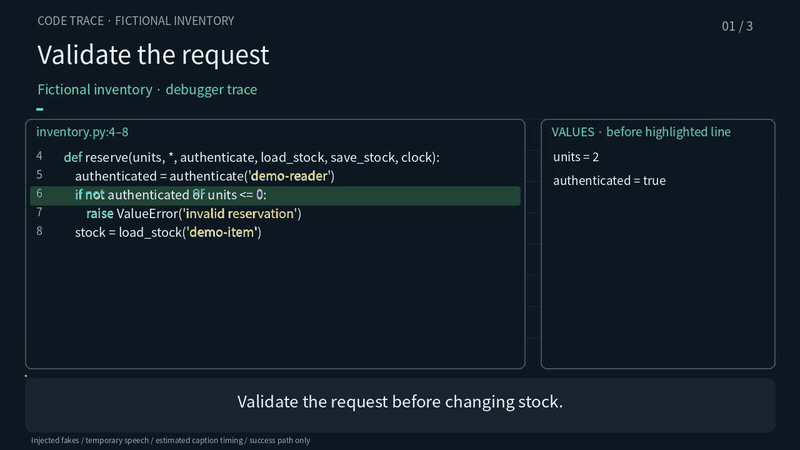

# Fictional code-trace example

English | [한국어](README.ko.md)

This example follows `inventory.py` as it reserves two units from a stock of five.
Authentication, reading/writing storage and time are injected fakes. The harness runs
the original function, records safe local variables before each executed line and records
storage arguments. It does not contact a service or contain private application code.

## Example output



[Watch or download the 18-second demo](preview/demo.mp4). This is the fictional
inventory fixture with temporary local English speech and estimated caption timing.

The animated GIF is silent; the MP4 includes temporary local English speech.
After a verified build, regenerate the MP4, GIF and still capture from its encoded master:

```bash
/tmp/code-trace-venv/bin/python example-code-trace/pipeline.py --export-preview
```

## Run from a repository checkout

Python 3.11+, Git, FFmpeg/ffprobe and the root pinned requirements are required.
Use macOS `say` (Samantha voice) or Linux `espeak` for temporary English speech.

```bash
python3 -m venv /tmp/code-trace-venv
/tmp/code-trace-venv/bin/pip install -r requirements.txt
PATH="/tmp/code-trace-venv/bin:$PATH" bash example/assets/fetch-font.sh
/tmp/code-trace-venv/bin/python example-code-trace/pipeline.py
# alternate line-focused presentation (values are labelled as illustrative):
/tmp/code-trace-venv/bin/python example-code-trace/pipeline.py --mode lines
```

The adapter copies the shared `prepare.py`, renderer/encoder, `qa.py`, drawing library
and `package.py` into the ignored `build/` directory. It adds source panels and measured
highlight cues, then uses the common pipeline. No paid TTS is called. Completed matching
local speech is reused. The original diagram example is unchanged by running this demo.

`build/master.mp4` is the full 1280×720/30fps H.264 + mono 48 kHz AAC demo.
`build/player.html` plays two relative MP4 parts without a server or remote resources.
Each part is encoded and checked separately, including frame count and full decode.
The default limit is **15,000,000 bytes**; larger groups are recursively split at scene
boundaries. A single oversized scene fails with a request to shorten it or lower bitrate.
The two-scene grouping deliberately exercises the multi-part player even for this small demo.

Run the regression checks after the debugger build:

```bash
/tmp/code-trace-venv/bin/python example-code-trace/test_invariants.py
```

## Reports and package replay

- `build/qa/code-trace.json`: original Git blob comparison, cue/panel bounds and every-frame
  real-font geometry (code and value overflow fail loudly).
- `build/qa/qa.json`: common encoded-file, motion, audio, cut and seek checks.
- `build/source-fidelity-review.json`: success-path claims and untested branches.
- `build/parts.json`: per-part size, hash, duration, frame count and source scene ranges.
- `build/source.zip`: re-renderable master source, shared scripts, font/license and audio.
- `build/qa/package-rerender.json`: clean archive extraction, real two-second encode and
  representative full-timeline RGB comparisons on the same machine.

For the extracted source archive, install its pinned requirements and run `render.py`,
then `qa.py`. It contains prepared data and narration; the repository-level `pipeline.py`
is not needed to replay it. The archive covers the master renderer; parts/player remain
local derivatives. Build products remain ignored. `preview/` contains only the intentionally selected
fictional MP4/GIF demo, encoded-frame capture and verification metadata for reviewers.

Line events show values **before** the highlighted line runs; the next event shows its
result. Caption and keyword timing is proportional within measured speech, not forced
alignment. This example is a prototype with temporary speech, not a polished narration.
No full human listen, ASR or independent content review is claimed. The success path
cannot establish behaviour with real auth/storage, or prove every error path works.
