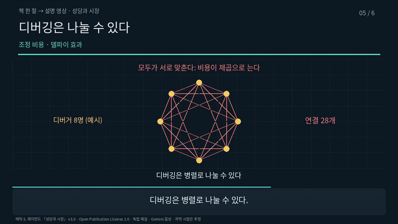

# 책 한 절 → 개념 설명 영상

[English](README.md) | 한국어

에릭 S. 레이먼드의 『성당과 시장』(v3.0)에서 '일찍 내고, 자주 내라' 절 하나를 여섯 장면짜리
설명 영상으로 만든 예제입니다. 같은 장면 계획으로 한국어판과 영어판을 따로 만들었습니다.



| | 한국어 | 영어 |
|---|---|---|
| 영상 | [ko.mp4](preview/ko.mp4) · 3분 4초 · 4.4MB | [en.mp4](preview/en.mp4) · 3분 7초 · 4.8MB |
| 자막 | [ko.srt](preview/ko.srt) · 39개 | [en.srt](preview/en.srt) · 38개 |
| 대표 화면 | [ko.png](preview/ko.png) | [en.png](preview/en.png) |

## 왜 이 원본인가

이 글은 Open Publication License 2.0으로 공개되어 있어 복제·배포·수정이 허용됩니다.
그래서 공개 저장소의 예제로 쓸 수 있습니다. 개인 학습용으로 만든 시판 도서 영상은 공개하지 않습니다.

원본은 [catb.org의 해당 절](http://www.catb.org/esr/writings/cathedral-bazaar/cathedral-bazaar/ar01s04.html)입니다.
`pipeline.py`가 이 페이지를 받아 SHA-256이 `plan.py`에 고정한 값과 같은지 먼저 확인합니다.
값이 다르면 빌드를 멈춥니다.

## 장면 구성

| 장면 | 원본 위치 | 주장 | 그림의 변화 |
|---|---|---|---|
| 1 | 첫 두 문단 | 버그를 덜 보이려는 목표가 긴 배포 주기를 낳았다 | 배포 눈금 여섯 개가 두 개로 줄어든다 |
| 2 | 교훈 7 | 새로운 것은 빠른 배포가 아니라 그 강도였다 | 눈금이 두 개에서 열여덟 개로 늘어난다 |
| 3 | 교훈 7 뒤 문단 | 잦은 배포가 사람의 시간을 최대로 끌어냈다. 대가도 있다 | 순환 고리가 돌고 상자가 최대화 대상으로 바뀐다 |
| 4 | 교훈 8 | 보는 눈이 충분하면 버그는 얕다. 찾는 사람과 고치는 사람은 다르다 | 깊은 버그가 표면으로 떠오른다 |
| 5 | 병렬화 문단 | 디버깅은 조정 비용이 제곱으로 늘지 않는다 | 연결 28개짜리 망이 8개짜리 별로 바뀐다 |
| 6 | 마지막 두 문단 | 측정이 아니라 경험에서 나온 논증이다. 버전 번호로 위험을 나눴다 | 배포 경로가 안정판과 최신판으로 갈라진다 |

에맥스 리스프 아카이브 일화, 스톨먼·고슬링과의 비교, 기여자의 자기 선택 이야기는 줄였습니다.
줄인 내용과 이유는 `build/<언어>/source-fidelity-review.json`에 남습니다.

## 만드는 방법

저장소 루트에서 실행합니다. 글꼴은 먼저 받아 둡니다
(`bash example/assets/fetch-font.sh`).

```bash
export GEMINI_API_KEY=...                       # 음성이 없는 장면에만 쓴다
export WHISPER_MODEL=/path/to/ggml-small.bin    # 선택: 음성 인식 비교
.venv/bin/python example-concept/pipeline.py              # 한국어와 영어
.venv/bin/python example-concept/pipeline.py --lang ko    # 한 언어만
```

| 파일 | 하는 일 |
|---|---|
| `plan.py` | 원본 정보, 장면 계획(한국어·영어), 원본 대조 목록 |
| `pipeline.py` | 원본 확인 후 언어마다 `example/variant.py` 실행 |
| `../example/variant.py` | 공통 스크립트를 `build/<언어>/`에 복사하고 음성→준비→렌더링→검사→패키지 순으로 실행 |
| `../example/gemini_tts.py` | 장면별 Gemini 음성 생성과 재사용 |

음성은 `audio-cache/<언어>/`에 남습니다. 대본·모델·목소리·말투 지시가 같으면 다시 만들지 않고,
이때는 API 키도 읽지 않습니다. 빌드 결과와 음성은 Git에서 제외되고, 검사를 통과한 영상과
자막만 `preview/`에 복사됩니다.

## 검사한 것

| 항목 | 결과 |
|---|---|
| 영상 형식 | 1280×720, 30fps, H.264 + AAC 모노 48kHz. 프레임 수 5,524(한국어) · 5,601(영어) 일치 |
| 전체 디코딩 | 오류 없음 |
| 장면 전환 | 전환 순간과 0.08·0.17·0.4초 뒤 화면 20장을 완성 파일에서 추출 |
| 글자 배치 | 장면마다 샘플 73장에서 글자끼리, 글자와 상자의 겹침 없음 |
| 음성 | 최대 진폭 0.742(한국어) · 0.796(영어), 잘린 샘플 0 |
| 렌더 결정성 | 같은 시점을 앞뒤 순서로 렌더링해 RGB 해시 일치(같은 컴퓨터 기준) |
| 패키지 재실행 | 압축(56개 파일)을 새 폴더에 풀어 2초 영상을 렌더링하고 RGB 해시 비교 |
| 음성 인식 비교 | whisper.cpp small 모델로 장면별 받아쓰기. 대본과의 일치도 한국어 0.868~0.993, 영어 0.998~1.0 |

음성은 Gemini `gemini-3.8-flash-lite-tts`의 `Charon` 목소리로 만들었습니다.

## 하지 않은 검사

- 사람이 영상 전체를 이어서 들어 보지 않았습니다. 음성 인식 일치도는 발음 품질 평가가 아닙니다.
- 자막 시점은 장면 안에서 글자 수에 비례해 나눈 추정값입니다. 정밀 정렬은 하지 않았습니다.
- 원본 대조는 제작자가 다시 읽은 것이며, 독립 검토자는 없었습니다.
- 눈금 수, 디버거 여덟 명, 버그의 깊이는 설명을 위한 비유입니다. 측정값이 아닙니다.
